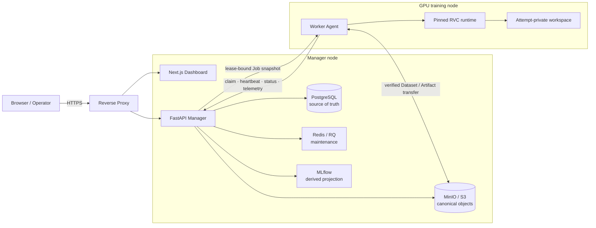

<h1 align="center">RVC Training Orchestrator</h1>

<p align="center"><strong>여러 GPU 학습 서버의 RVC 학습을 한곳에서 계획하고, 실행하고, 검증하는 오케스트레이션 플랫폼</strong></p>

<p align="center">Dataset · Experiment · Job · Worker · Telemetry · Artifact · Sample · Model Registry</p>

<p align="center"><code>RVC v1/v2</code> &nbsp; <code>FastAPI</code> &nbsp; <code>Next.js</code> &nbsp; <code>PostgreSQL</code> &nbsp; <code>Redis/RQ</code> &nbsp; <code>MinIO/S3</code> &nbsp; <code>MLflow</code></p>

<p align="center"><a href="#아키텍처">아키텍처</a> · <a href="#rvc-지원-범위">지원 범위</a> · <a href="#개발-시작">개발 시작</a> · <a href="#현재-출시-상태">출시 상태</a> · <a href="#문서-지도">문서 지도</a></p>

> [!IMPORTANT]
> 이 저장소는 아직 `v1.0` production release가 아니다. 중앙 기능과 Fake Worker 기반 E2E는
> 폭넓게 검증됐지만, 실제 NVIDIA GPU/RVC runtime, 49-case qualification, clean Ubuntu 설치,
> 브라우저 접근성, 외부 TLS 및 supply-chain 최종 인수는 남아 있다. Fake 결과를 실제 RVC 학습
> 증거로 해석하지 않는다.

## 무엇을 해결하나

RVC 학습을 여러 서버에서 운영하면 데이터셋 준비, GPU 배정, 장시간 작업의 상태 추적, 산출물 수집,
실험 비교와 재현성 확보가 서로 다른 스크립트와 디렉터리에 흩어지기 쉽다. RVC Training
Orchestrator는 이 흐름을 중앙 Manager와 원격 Worker로 나눠 하나의 검증 가능한 작업 원장으로
관리한다.

| 관심사 | 제공하는 경계 |
|---|---|
| 중앙 관리 | Dataset, Experiment, Job, Worker, 사용자와 모델 승인 상태를 한곳에서 관리한다. |
| 분산 실행 | GPU Worker가 lease로 작업을 하나씩 claim하고 RVC 엔진을 로컬에서 실행한다. |
| 실시간 관측 | 학습 로그, loss/epoch, GPU 사용률, VRAM, 온도와 disk 상태를 attempt 순서에 맞춰 수집한다. |
| 산출물 검증 | 모델, 체크포인트, 인덱스와 샘플의 크기·SHA-256·provenance를 검증한 뒤 canonical object로 게시한다. |
| 실험 비교 | 같은 Experiment의 설정, 지표, 산출물과 동일 TestSet item의 Sample을 나란히 비교한다. |
| 운영 안전 | 인증 분리, 원자적 lease, immutable JobConfig, 경로 검증, non-root container와 최소 권한을 기본값으로 둔다. |

### 이런 흐름에 맞는다

- 한 대의 중앙 서버에서 여러 GPU 학습 서버의 상태와 작업을 관리하고 싶을 때
- RVC v1/v2, F0 방식과 학습 설정 조합을 같은 Dataset 기준으로 비교하고 싶을 때
- `G_*.pth`/`D_*.pth` 체크포인트와 배포용 small model을 혼동하지 않고 수집하고 싶을 때
- 모델·인덱스·샘플을 실행 attempt, runtime image와 asset checksum까지 추적하고 싶을 때
- 개발용 Fake 실행과 실제 `rvc_webui` 실행을 UI와 원장에서 명확히 구분하고 싶을 때

## 아키텍처

Manager는 제어 평면과 중앙 원장을 담당하고, Worker만 RVC 학습 프로세스를 실행한다. Redis나 내부
데이터베이스를 Worker에 노출하지 않으며, Worker는 Manager의 HTTP protocol로만 작업을 claim하고
lease를 갱신한다.



### 구성 요소

| 구성 요소 | 역할 | 하지 않는 일 |
|---|---|---|
| **Manager API** | 인증, Dataset/Experiment/Job 원장, lease, 업로드 검증, 상태 전이와 audit | RVC 학습 명령 실행 |
| **Dashboard** | Dataset/Job/Worker 관측, Experiment 비교, Sample 재생, 사용자·모델 관리 | 사용자 token을 외부 object endpoint로 전달 |
| **Worker Agent** | GPU 상태 보고, 작업 claim, RVC stage 실행, telemetry spool, Artifact 업로드 | PostgreSQL/Redis에 직접 접근 |
| **RVC adapter** | pinned RVC source를 typed argv로 실행하고 v1/v2 산출물을 정규화 | shell 문자열 실행, stage 자동 재실행 |
| **PostgreSQL** | 권한, 상태, attempt, checksum과 idempotency의 authoritative ledger | 대형 binary 저장 |
| **MinIO/S3** | Dataset, TestSet, Artifact와 Sample의 canonical byte 저장 | 검증 없이 object를 완료 상태로 승격 |
| **Redis/RQ** | 중앙 maintenance queue와 rate limit | 외부 Worker 작업 배정 |
| **MLflow** | 완료된 실행의 durable 파생 projection | Model Registry의 승인 원장 역할 |

## 작업이 흘러가는 방식

1. **Dataset 등록**

   사용자가 archive를 업로드하면 Manager가 MIME, 크기, 압축 경로, symlink, 중복과 압축 폭탄을
   검사한다. 현재 지원하는 PCM WAV는 안전한 이름의 flat Dataset으로 준비하고 품질 지표를 계산한다.

2. **Experiment와 Job 생성**

   Dataset에 immutable Experiment를 결박하고 학습 설정을 선택한다. Job 생성 시 기본값까지 채운
   canonical `JobConfig` JSON과 SHA-256을 같은 transaction에 저장한다.

3. **원자적 작업 배정**

   capability가 맞는 Worker 하나가 Job을 claim한다. Manager는 Job과 attempt에 같은 설정 hash를
   복제하고 lease를 발급하며, Worker는 workspace를 만들기 전에 wire payload를 다시 검증한다.

4. **격리된 RVC 실행**

   Worker는 attempt 전용 workspace와 검증된 read-only RVC projection을 사용한다. preprocess, F0,
   feature, training, index와 선택적 sample stage는 인자 배열로 실행되며 같은 stage를 자동 재실행하지
   않는다.

5. **관측 정보 전송**

   로그와 metric sequence는 각각 0부터 증가하고 Worker의 local spool에 먼저 기록된다. Manager 장애
   중에도 순서를 보존하며, terminal status는 log/metric watermark와 함께 attempt를 봉인한다.

6. **산출물 게시와 완료 판정**

   Worker가 Artifact upload session으로 byte를 전송하면 Manager가 전체 크기와 SHA-256을 다시 확인해
   canonical object로 게시한다. 필수 model/index/sample과 현재 lease·attempt·config hash가 모두
   일치해야 Job을 완료할 수 있다.

7. **비교와 승인**

   Dashboard에서 설정, 지표와 같은 TestSet item의 Sample을 비교한다. Model Registry는 실제
   `rvc_webui` 완료 attempt와 승인된 runtime provenance에 결박된 canonical model/index만 후보로
   받아 `candidate → approved → revoked` 원장을 유지한다.

## 주요 기능

아래 상태는 구현 유무와 production qualification을 구분한다.

- **구현·회귀 검증**: source test 또는 fixture/E2E로 계약이 검증됐다.
- **부분 검증**: 핵심 구현은 있으나 실제 browser, GPU, 외부 storage 또는 clean-host 증거가 남아 있다.
- **출시 차단**: 구현 flag가 아니라 별도 runtime/운영 증적이 충족돼야 열린다.

| 영역 | 현재 제공 범위 | 상태 |
|---|---|---|
| 사용자 인증 | bootstrap admin, JWT/session, RBAC, 사용자 lifecycle, token version 폐기 | 구현·회귀 검증 |
| Worker 인증 | 별도 token, 2단계 회전, 관리자 폐기, inactive identity 재등록 | 구현·회귀 검증 |
| Dataset | bounded upload, canonical flat ZIP, WAV 검증, PCM/LUFS 품질 집계 | 부분 검증 |
| Job orchestration | immutable config hash, atomic claim, lease/heartbeat, retry/recovery fence | 구현·회귀 검증 |
| Telemetry | durable spool, log/metric idempotency, terminal watermark, GPU/disk snapshot | 부분 검증 |
| Artifact data plane | conditional upload, full-byte 검증, canonical publication, 이중 cleanup | 구현·회귀 검증 |
| TestSet/Sample | immutable TestSet, lease-bound 수신, Sample 등록·재생·A/B 비교 | 부분 검증 |
| Experiment | immutable name/Dataset, description CAS, 참조 안전 삭제, Run 비교 | 부분 검증 |
| Model Registry | candidate/approved/revoked, active champion 0/1, rollback promotion | 부분 검증 |
| MLflow | retry 가능한 durable outbox 기반 projection | 구현·회귀 검증 |
| 설치·운영 | 분리 bundle, backup/restore/rollback, checksum/image closure | 부분 검증 |
| Native GPU/Sample | guarded adapter와 qualification binding | 출시 차단 |

세부 항목의 authoritative 상태는 [CHECKLIST.md](CHECKLIST.md), 요구사항별 인수 조건은
[docs/REQUIREMENTS_TRACEABILITY.md](docs/REQUIREMENTS_TRACEABILITY.md)를 따른다.

## RVC 지원 범위

| 구분 | 지원 범위 | 비고 |
|---|---|---|
| RVC version | `v1`, `v2` | `v3`는 현재 지원하지 않는다. |
| Feature directory | v1 `3_feature256`, v2 `3_feature768` | version 의미를 보존한다. |
| 학습 F0 | `pm`, `harvest`, `dio`, `rmvpe`, `rmvpe_gpu` | `rmvpe_gpu`는 visible GPU capability가 필요하다. |
| Sample inference F0 | `pm`, `harvest`, `crepe`, `rmvpe` | 학습 전용 방식과 별도 계약이다. |
| 배포 모델 | `weights/<experiment>.pth` 또는 공식 checkpoint 추출 결과 | `G_*.pth`를 small model로 복사하지 않는다. |
| 체크포인트 | `logs/<experiment>/G_*.pth`, `D_*.pth` | pair와 epoch 의미를 보존한다. |
| 최종 인덱스 | `added_*.index` → `index/final.index` | 원본 이름과 checksum을 metadata에 남긴다. |
| 보조 feature | `total_fea.npy` | 최종 index와 별도 Artifact다. |
| Runtime 후보 lock | Torch `2.6.0+cu124`, Torchvision `0.21.0+cu124`, Torchaudio `2.6.0+cu124`, CUDA `12.4` | 후보 조합이며 아직 release qualification 전이다. |

`auto_inference_samples.enabled=true`일 때 index를 만들지 않으면 `index_rate`는 반드시 `0`이어야 한다.
없는 index나 승인되지 않은 runtime으로 조용히 fallback하지 않는다. 자세한 호환성 및 출시 gate는
[RVC runtime matrix](docs/RVC_RUNTIME_MATRIX.md)와
[runtime qualification](docs/RUNTIME_QUALIFICATION.md)을 참고한다.

## 안전성과 재현성

이 프로젝트는 “실행됐다”는 선언보다 “어떤 입력과 실행 환경으로 어떤 byte를 만들었는가”를 증명하는
쪽에 무게를 둔다.

| 원칙 | 보장하는 내용 |
|---|---|
| Manager/Worker 분리 | 제어 평면 침해가 곧바로 중앙 서버의 학습 명령 실행으로 이어지지 않게 한다. |
| 인증 흐름 분리 | 사용자 JWT와 Worker token을 서로 대체할 수 없고 원문 credential을 DB/로그에 남기지 않는다. |
| Immutable JobConfig | Job, attempt와 claim이 같은 canonical config SHA-256을 사용하며 active write마다 다시 확인한다. |
| 단일 active lease | 한 Job을 동시에 여러 Worker가 학습하지 않도록 claim·renew·terminal 전이를 원자화한다. |
| Canonical byte 검증 | Worker가 올린 URI를 신뢰하지 않고 Manager가 size/SHA-256을 재검증한 뒤 완료한다. |
| 경로·프로세스 격리 | archive traversal/symlink escape를 차단하고 RVC를 shell 없이 attempt workspace에서 실행한다. |
| Telemetry watermark | terminal 뒤 허용할 late batch의 정확한 상한을 attempt별로 보존한다. |
| 최소 권한 runtime | API/Web/Worker는 non-root, MLflow는 고정 UID/GID와 read-only rootfs를 유지한다. |
| Evidence-gated capability | GPU/Sample capability는 env boolean이 아니라 승인된 qualification archive로만 활성화한다. |

구체적인 threat boundary와 운영 기본값은 [보안 문서](docs/SECURITY.md), 서비스 경계와 불변 조건은
[아키텍처 문서](docs/ARCHITECTURE.md)에 있다.

## 현재 출시 상태

### 한눈에 보기

| 대상 | 현재 상태 | 가능한 것 | 아직 의미하지 않는 것 |
|---|---|---|---|
| 최신 source | `a7c4e9f2b610` schema head | Manager/API/Web/DB와 Fake Worker 기능 검증 | 새 self-contained 설치 archive |
| dev.20 Manager | `SELF_CONTAINED=true` 개발 후보 | 정확한 8개 linux/amd64 image의 설치·Compose 시험 | clean Ubuntu production 인수 |
| dev.20 Worker | `SELF_CONTAINED=false` partial archive | 구성·보호 gate 시험 | native GPU 학습 또는 offline 설치 |
| Native Sample | capability disabled | fixture 기반 publication/completion 계약 시험 | 실제 CREPE/GPU Sample qualification |

### 구현된 핵심 경계

- 인증·원장, Dataset/Artifact data plane과 lease 기반 Worker protocol
- 실시간 Dashboard, MLflow durable projection과 immutable Experiment/TestSet/Preset/Sample 관계
- JobConfig canonical hash의 Job → attempt → claim → terminal/Artifact/Sample 전 구간 결박
- Dataset/TestSet/Artifact upload token, heartbeat, absolute deadline과 확인형 cleanup
- Worker token 회전·폐기, 관리자 사용자 lifecycle과 이전 access token 영구 fencing
- 실험 비교, 검증된 Sample range streaming과 Model Registry 승인 원장
- Manager/Worker bundle builder, strict checksum inventory, image identity, backup/restore/rollback

### 남은 주요 release gate

- multipart/resume upload와 격리된 non-WAV decoder
- Dataset finalize/retention maintenance의 남은 범위
- 실제 CREPE weight 출처·라이선스·SHA-256 승인
- reviewed amd64 base digest와 Torch/CUDA runtime의 전체 49-case GPU/no-network matrix
- PostgreSQL multi-replica 경쟁, 외부 MinIO/S3 대용량·tamper·outage와 장기 PUT 장애 주입
- 실제 browser의 Experiment/User/Registry 응답 유실, 반응형, keyboard와 screen-reader 인수
- 외부 TLS 종단, custom CA, clean Ubuntu 22.04/24.04 및 NVIDIA GPU 설치 smoke
- 완전한 SBOM, 취약점·container·secret scan과 법적 license review

현재 production Agent는 증적 없이 `fixed_test_set_inference_ready` 또는 auto-sample capability를 열 수
없다. 전체 진행률과 미완료 항목은 [개발 체크리스트](CHECKLIST.md)에만 판정한다.

## 개발 시작

### 준비 환경

- Python `3.11`
- Node.js `20.9` 이상
- npm lockfile 기준 의존성
- Docker/Compose는 별도 infra·installer smoke를 실행할 때만 필요
- 실제 native Worker 검증에는 지원 NVIDIA host와 별도 runtime qualification 입력이 필요

### 1. 개발 의존성 설치

```bash
make bootstrap
```

이 명령은 `.venv`를 만들고 Python 개발 의존성을 설치한 뒤 `apps/web`에서 `npm ci`를 실행한다.
최초 실행은 Python/NPM registry 접근 또는 사전 준비한 cache가 필요하다.

### 2. 기본 source 검증

```bash
make check
```

`make check`는 Ruff, strict mypy, Python unit/integration test, Web Vitest/ESLint/production build,
shell 문법과 Git whitespace를 검사한다. 다음 항목은 포함하지 않는다.

- localhost socket을 사용하는 Manager↔Fake Worker HTTP E2E
- Docker image build와 Compose service 기동/health
- 실제 installer 실행과 volume recovery drill
- NVIDIA GPU 또는 native RVC 학습

### 3. localhost protocol E2E

```bash
make test-e2e
```

임시 SQLite, 실제 localhost Uvicorn과 명시적으로 opt-in한 Fake Worker를 사용해 Dataset → Job claim →
telemetry → Artifact → completion 흐름을 검증한다. 이 테스트의 GPU와 RVC event는 fixture이므로 실제
NVIDIA/RVC 정확도 증거가 아니다.

Docker, installer, migration, data plane과 runtime별 세부 명령은 [자동 테스트 문서](docs/TESTING.md),
사용자 실행 순서와 합격 증적은 [테스트 가이드](docs/TEST_GUIDE.md)를 따른다.

## 저장소 구조

```text
.
├── apps/
│   ├── api/                 # FastAPI Manager와 Alembic migration
│   ├── web/                 # Next.js Dashboard와 same-origin BFF
│   └── worker/              # GPU Worker Agent와 RVC adapter
├── packages/contracts/      # Manager↔Worker 공유 wire/domain contract
├── infra/                   # Compose, runtime projection과 qualification 도구
├── installers/              # Manager/Worker Linux bundle builder와 lifecycle script
├── tests/                   # E2E, infra, installer와 recovery 검증
├── docs/                    # 아키텍처·설치·운영·시험·보안 문서와 ADR
├── CHECKLIST.md             # 구현 및 인수 상태의 authoritative checklist
└── AGENTS.md                # 사람과 자동화 agent의 공통 작업 규칙
```

## 검증된 개발 설치 번들

dev.20 archive는 source commit `298ee1ec112cc7dc3a55d8374bba8c9e38f9f55a`와 Manager schema head
`f5d1c8a9b240`에 결박된 **역사적 개발 산출물**이다.

| Bundle | 크기 | 성격 |
|---|---:|---|
| `rvc-manager-0.1.0-dev.20-linux-amd64.tar.gz` | `667,617,422` byte | 8개 linux/amd64 image를 포함한 self-contained Manager 후보 |
| `rvc-worker-0.1.0-dev.20-linux-amd64.tar.gz` | `108,488` byte | runtime image가 없는 partial Worker archive |

```text
Manager SHA-256  c6488dad47c7f38c082ed6fa68f1fe3691c069110aef0bbf68a9d7ba5e6f5b70
Worker SHA-256   7f36cbf27100bf70425c2780142d4fa3f6e6e76d0acf410d3e3fb698aa50558b
```

각 archive의 sidecar `.sha256`, 내부 `SHA256SUMS` exact inventory와 image manifest v2가 검증됐다.
Manager는 image 포함 기능 시험에 사용할 수 있지만, Worker는 image/runtime/GPU/profile/Sample gate가
모두 비어 있거나 false다. 둘을 air-gapped production release 또는 `v1.0.0`으로 표현하면 안 된다.

> [!WARNING]
> 현재 checkout의 schema head는 dev.20보다 새로운 `a7c4e9f2b610`이다. `config_sha256`이 Job claim의
> 필수 wire field가 됐으므로 현재 Manager/Worker source는 같은 새 release로 배포해야 한다. dev.20
> Worker를 현재 Manager source와 혼용하거나 기존 archive를 새 source 설치 파일로 재표시하지 않는다.

<details>
<summary><strong>dev.12 → dev.20 개발 번들 변화 요약</strong></summary>

- **dev.12** — runtime secret projection, exact MinIO policy, authoritative engine mode와 Fake 경고
- **dev.13** — Dataset integrated LUFS, strict release file/environment closure, bundle-local 문서
- **dev.14** — proxy foreground 실행, MinIO/MLflow loopback publish와 Manager Compose smoke
- **dev.15** — source ignore closure, Docker config digest, forward-only upgrade와 실패 전파
- **dev.16** — physical release runbook, overlay lock, Manager release orchestrator와 readiness report
- **dev.17** — Experiment 비교, Worker custom CA와 공통 strict SSL context
- **dev.18** — Model Registry 원장/API/BFF/UI와 migration
- **dev.19** — maintenance 전용 PostgreSQL/Redis/S3 identity와 장기 cleanup heartbeat
- **dev.20** — clean committed source 기반 정확한 8-image linux/amd64 Manager closure

dev.15 이하에는 현재 runbook·custom CA 보정 또는 code guard가 부족하므로 새 설치·시험 기준으로
사용하지 않는다. 상세 결정과 검증 근거는 [개발 이력](docs/DEVELOPMENT_HISTORY.md)에 남아 있다.

</details>

## 최근 검증 기준선

검증 숫자는 해당 revision의 역사적 증거이며, 이후 실행이 같은 개수여야 한다는 뜻은 아니다.

| 기준선 | 확인된 결과 | 한계 |
|---|---|---|
| dev.20 committed source | Python `752 passed, 4 deselected`, mypy 88 files, Web 24 files/211 tests, HTTP E2E 4 passed | archive와 일치하는 과거 revision |
| dev.20 Manager runtime | PostgreSQL 16, Redis 7.4, MinIO, MLflow, secret projection, 8-image Compose smoke PASS | arm64 Colima의 amd64 emulation |
| 현재 `a7c4e9f2b610` source | Python `859 passed, 4 deselected`, mypy 91 files, Web 26 files/223 tests, 19-page build, HTTP E2E 4 passed | 새 self-contained archive와 실제 GPU 증거 아님 |

마지막 전체 source 검증일은 `2026-07-13`이다. 실행 명령, warning, 제외 항목과 환경을 포함한 원문
증거는 [테스트 문서](docs/TESTING.md)와 [개발 이력](docs/DEVELOPMENT_HISTORY.md)을 확인한다.

## 문서 지도

### 처음 읽는 순서

1. [AGENTS.md](AGENTS.md) — 저장소 안전 규칙과 작업 전·후 의무
2. [CHECKLIST.md](CHECKLIST.md) — 현재 단계, 검증된 항목과 남은 출시 gate
3. [개발 이력](docs/DEVELOPMENT_HISTORY.md) — 직전 결정, 변경 파일, 검증 결과와 남은 위험
4. [아키텍처](docs/ARCHITECTURE.md) — 서비스 경계, 상태 전이와 핵심 불변 조건
5. [요구사항 추적표](docs/REQUIREMENTS_TRACEABILITY.md) — 요구사항 ID별 인수 조건과 상태

### 목적별 안내

| 하고 싶은 일 | 먼저 볼 문서 |
|---|---|
| Manager/Worker를 설치하고 싶다 | [설치 가이드](docs/INSTALLATION_GUIDE.md) |
| 사용자 인수 시험을 실행하고 결과를 남기고 싶다 | [테스트 가이드](docs/TEST_GUIDE.md) · [결과 템플릿](docs/TEST_RESULT_TEMPLATE.md) |
| 자동 test와 fixture 범위를 알고 싶다 | [테스트 상세](docs/TESTING.md) |
| bundle을 만들거나 배포·업그레이드하고 싶다 | [배포 문서](docs/DEPLOYMENT.md) |
| 장애, backup, restore와 일상 운영을 수행하고 싶다 | [운영 가이드](docs/OPERATIONS_GUIDE.md) |
| RVC/Torch/CUDA 조합을 검토하고 싶다 | [RVC runtime matrix](docs/RVC_RUNTIME_MATRIX.md) · [upstream notes](docs/RVC_UPSTREAM_NOTES.md) |
| 실제 GPU 결과로 capability를 열고 싶다 | [runtime qualification](docs/RUNTIME_QUALIFICATION.md) |
| 인증·secret·network 경계를 검토하고 싶다 | [보안 문서](docs/SECURITY.md) |
| SBOM과 license 증명 범위를 확인하고 싶다 | [supply-chain 문서](docs/SUPPLY_CHAIN.md) |
| 주요 설계 결정을 확인하고 싶다 | [ADR-0001](docs/adr/0001-remote-worker-job-claim.md) · [ADR-0002](docs/adr/0002-canonical-dataset-preparation.md) · [ADR-0003](docs/adr/0003-installation-platform.md) · [ADR-0004](docs/adr/0004-fixed-testset-sample-provenance.md) |

## 작업에 참여할 때

코드나 문서를 바꾸기 전에 반드시 [AGENTS.md](AGENTS.md)를 읽고 `git status --short`로 다른 작업자의
변경을 확인한다. 구현은 관련 요구사항 ID와 연결하고, 실제로 완료·검증한 항목만 CHECKLIST에서
완료 처리한다.

작업을 마칠 때는 다음을 함께 남긴다.

- 변경 목적과 영향을 받은 파일
- 핵심 결정과 보존해야 할 불변 조건
- 실행한 검증 명령과 실제 결과
- 아직 남은 위험과 production 인수에 포함되지 않는 범위

모든 코드·구성·운영 변경은 [개발 이력](docs/DEVELOPMENT_HISTORY.md)의 최신 날짜 아래에 기록한다.
설치·운영·테스트 흐름을 바꿨다면 관련 가이드와 요구사항 추적표도 같은 변경에서 갱신한다.
